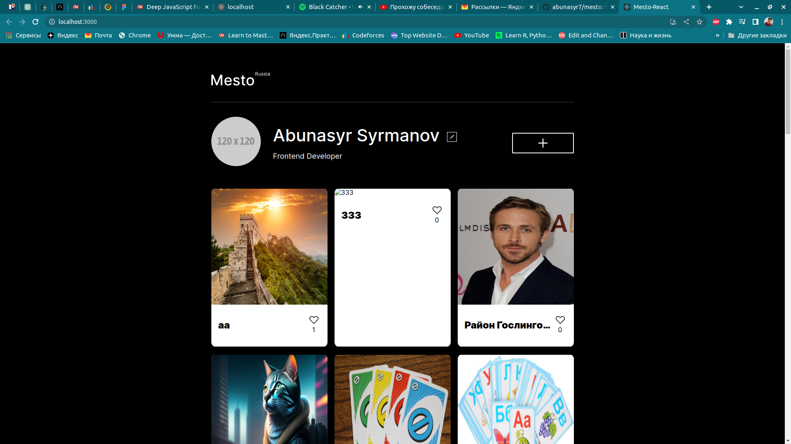

# Сдача проекта Mesto: портирование на «Реакт»

В данном проекте было необходимо создать полноценное веб-приложение с использование фреймоврка ReactJS.

Целью данного проекта является редактирование профиля, добавление и удаление карточек, а также действия с кнопкой ("Лайк").

## Использование

Для начала необходимо выбрать корректную версию `node` с помощью команды

```shell
nvm use
```

Далее для запуска проекта необходимо установить все необходимые пакеты и запустить проект, команды показаны нижу

```shell
yarn install
yarn start
```

## Функциональность

В данном проекте был использован популярный фреймворк ReactJS.

Все динамические действия на сайте были написать с помощью него. Весь проект написан с использованием функционального подхода.

## Технологии

- HTML5
- CSS3
- ReactJS




